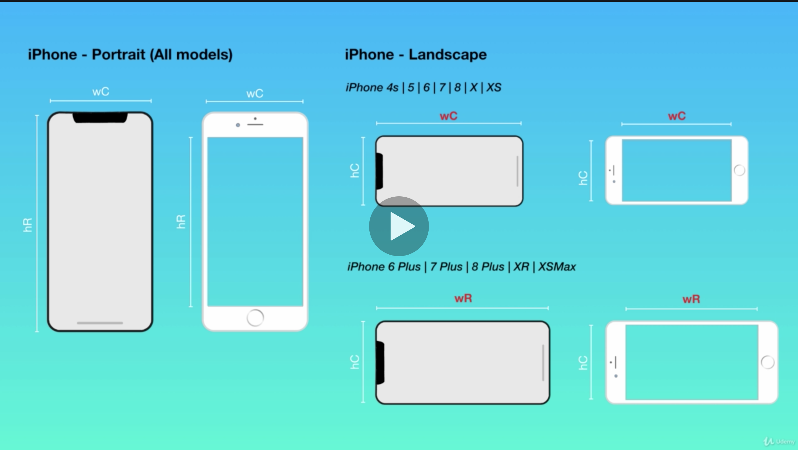
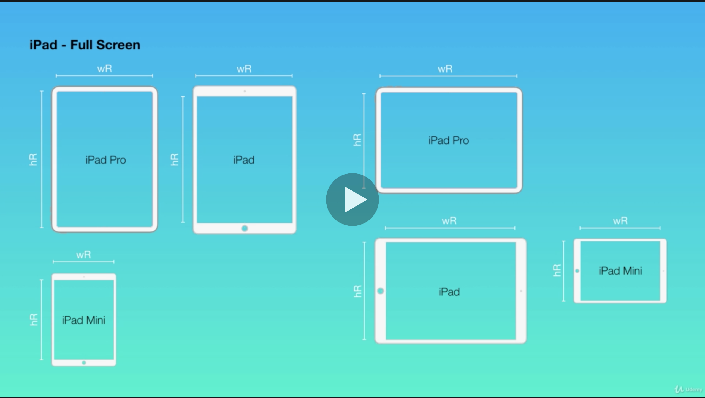
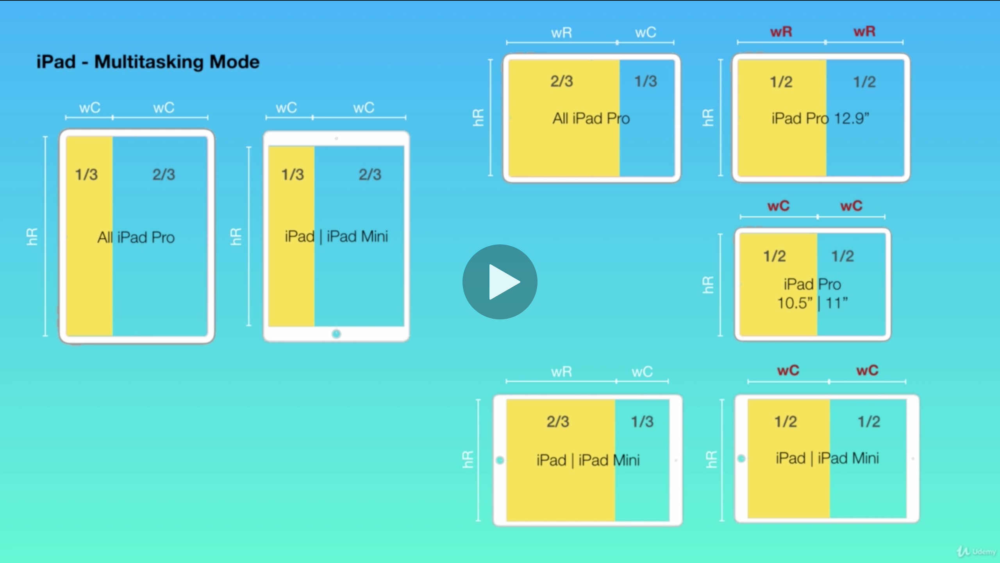
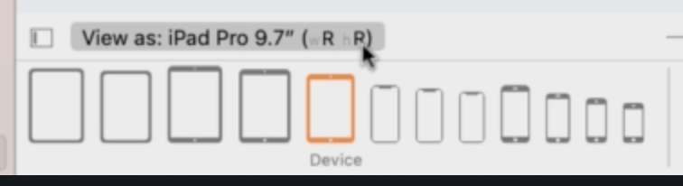
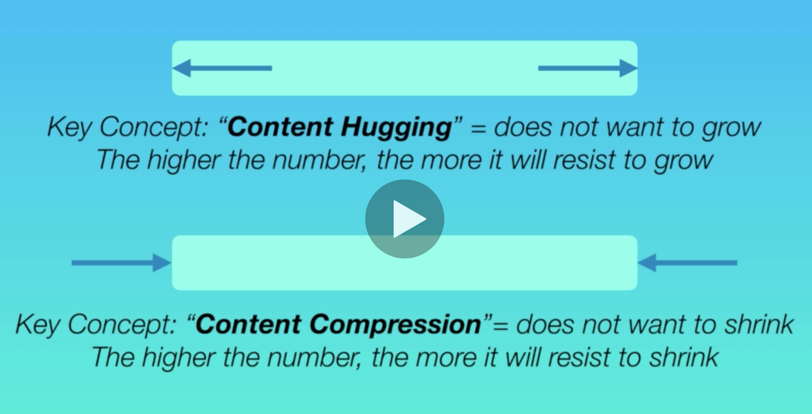
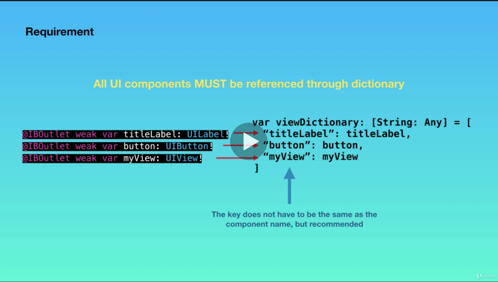
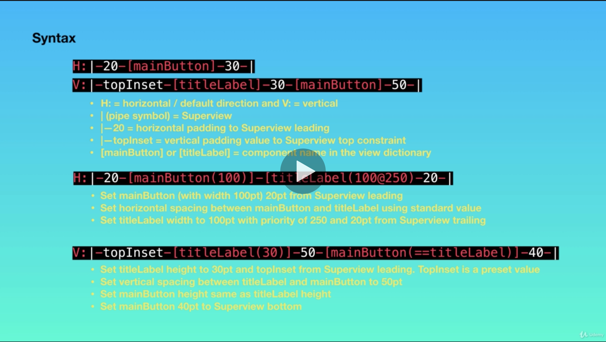

# ios-studies

## utils

### documentation Swift
- https://www.appcoda.com/swift-markdown/
- https://nshipster.com/swift-documentation/

### show hidden files
```shell script
defaults write com.apple.Finder AppleShowAllFiles true
killall Finder
```

### cocoa pod commands
- site: https://cocoapods.org/
```
# install
sudo gem install cocoapods

# start pod on project
pod init

# install pods
pod install

# cache clean
pod cache clean
```
## ways to make view
- SwiftUI
- Xib
- StoryBoard

## architectures
- VIPER
- MVP

## Tutorial
- 

## Tips
### MacOS shortcuts
- cmd + ` : alternate between same app windows
- cmd + TAB : alternate between apps

### tutorials and tips
- 10 Xcode Tips & Tricks - Xcode 10: https://www.youtube.com/watch?v=1uVnWbygg_c&feature=youtu.be
- 20 Xcode Tips & Tricks - Updated for Xcode 9 - 2017: https://www.youtube.com/watch?v=38LNXk_oTak&feature=youtu.be
- Xcode shortcut: https://supereasyapps.com/blog/2014/9/15/14-xcode-time-saving-shortcuts-memorize-and-improve-your-productivity
- Improve XCode workflow: https://medium.com/@gabriel_lewis/tips-to-improve-your-xcode-workflow-9c2bdda1b26f
- fix XCode odd errors: https://github.com/codepath/ios_guides/wiki/Fixing-Xcode
- Swiftui tutorial: https://developer.apple.com/tutorials/swiftui/
- iOS Programming roadmap: https://www.reddit.com/r/iOSProgramming/comments/82w6qa/2018_roadmap_to_ios_development/
- lldb: https://medium.com/flawless-app-stories/debugging-swift-code-with-lldb-b30c5cf2fd49
- lldb wwdc2019: https://developer.apple.com/videos/play/wwdc2019/429/

### track build times
```
defaults write com.apple.dt.Xcode ShowBuildOperationDuration -bool YES
```

### function name place holder
```swift
func <#name#> () {
    print("something")
}
```

### warning/error message pattern
```swift
// allow compile
#warning("example of a message")

// don't allow compile
#error("some error")
```

### pring var debug in lldb
```
po yourVariable
```

### xcode shortcuts
- cmd + R : run
- cmd + B : build
- cmd + shift + K : clean

- cmd + T : tabs

- cmd + shift + L : library
- cmd + option + shift + L : library fixed

- ctrl + shift + click : multi cursor
- option + drag : vertical selection

- cmd + shift + F : find navigator

- cmd + 0(zero) : show/hide left panel
- cmd + 1...9 : navigate left panel

- cmd + option + 0(zero) : show/hide right panel
- cmd + option + 1...4 : navigate right panel

- ctrl + 6 : file jump method/variable

- cmd + shift + O : open file quickly

- cmd + option + A : add file to the project

- cmd + D : duplicate element
- option + click: show variable type
- cmd + = : resize UI(Button|Label) element to fit the text inside

- ctrl + I : format code
- cmd + A : select all
- cmd + C : copy
- cmd + V : paste

- cmd + click : action: rename

- cmd + shift + 0(zero) : documentation and reference

- cmd + O : open project/file

- cmd + shift + N : new project

- ctrl + cmd + j : jump to Definition
- cmd + shift + j : reveal in project navigator
- ctrl + cmd + Forward Arrow or Ctrl + Command + Back Arrow : back and forward
- ctrl + cmd + ' : auto fix next error
- ctrl + cmd + " : auto fix prev error

### xcode build time track
- colocar no terminal: `defaults write com.apple.dt.Xcode ShowBuildOperationDuration -bool YES`


## Swift
### null check
- https://stackoverflow.com/questions/54966200/does-swift-have-standard-scope-functions-like-in-kotlin

#### extension
```swift
extension Optional {
    func `let`(do: (Wrapped)->()) {
        guard let v = self else { return }
        `do`(v)
    }
}

var str: String? = "text"
str.let {
    print( $0 ) // prints `text`
}
str = nil

str.let {
    print( $0 ) // not executed if str == nil
}
```

#### map
```swift
// prints 123
let str1 : String? = "123"
str1.map { print($0) }

// doesn't print anything
let str2 : String? = nil
str2.map { print($0) }
```

#### idiomatic
```swift
var str: String? = "123"
if let s = str { 
    print(s) 
}

let str2: String? = "123"
guard let strUnwrapped = str2 else { return }
```

## iOS
### Size classes









### Content hugging and compression



### Visual format language




### enable touch gesture recognizer
```swift
#warning("remove after development, created only to test")
func configureTapEvent() {
    let tapGestureRecognizer = UITapGestureRecognizer(target: self, action: #selector(imageViewTapped(tapGestureRecognizer:)))
    imageView.isUserInteractionEnabled = true
    imageView.addGestureRecognizer(tapGestureRecognizer)
}

#warning("remove after development, created only to test InvoiceCategoryViewController")
@objc func imageViewTapped(tapGestureRecognizer: UITapGestureRecognizer) {
    print("tapped")
}
```

### circular button
```swift
var myButton = UIButton()
myButton.backgroundColor = .red
myButton.frame = CGRect(x: 0, y: 0, width: 32, height: 32)
myButton.clipsToBounds = true
myButton.layer.cornerRadius = 0.5 * myButton.bounds.size.width
```

### button click event
```swift
var myButton = UIButton()
myButton.addTarget(self, action: #selector(buttonTap(tapGestureRecognizer:)), for: .touchUpInside)

@objc func buttonTap(tapGestureRecognizer: UITapGestureRecognizer) {
    print("tapped")
}
```

### navitate to another viewController
```swift
let vc = SomeViewController()
self.navigationController?.pushViewController(vc, animated: true)
```

### code marks
```swift
//MARK: some simple mark
//MARK: - some mark with division
//FIXME: fix me mark
//TODO: some to do mark
#warning("warning mark")
#error("error mark")

// MARK: - divide this title mark -

// TODO: -
// TODO: some grouped mark with division
// TODO: -
```

### group by date
- https://medium.com/@karsonbraaten/easily-group-objects-by-a-date-property-in-swift-e803d450f30e

```swift
func groupedEpisodesByMonth(_ episodes: [Episode]) -> [Date: [Episode]] {
  let empty: [Date: [Episode]] = [:]
  return episodes.reduce(into: empty) { acc, cur in
      let components = Calendar.current.dateComponents([.year, .month], from: cur.airDate)
      let date = Calendar.current.date(from: components)!
      let existing = acc[date] ?? []
      acc[date] = existing + [cur]
  }
}
```

### create date from string
- https://stackoverflow.com/questions/24089999/how-do-you-create-a-swift-date-object

```swift
class Date {

    class func from(year: Int, month: Int, day: Int) -> Date {
        let gregorianCalendar = NSCalendar(calendarIdentifier: .gregorian)!

        var dateComponents = DateComponents()
        dateComponents.year = year
        dateComponents.month = month
        dateComponents.day = day

        let date = gregorianCalendar.date(from: dateComponents)!
        return date
    }

    class func parse(_ string: String, format: String = "yyyy-MM-dd") -> Date {
        let dateFormatter = DateFormatter()
        dateFormatter.timeZone = NSTimeZone.default
        dateFormatter.dateFormat = format

        let date = dateFormatter.date(from: string)!
        return date
    }
}

// examples
var date = Date.parse("2014-05-20")
var date = Date.from(year: 2014, month: 05, day: 20)
```

### string
```swift
let string = "hello Swift"
if string.contains("Swift") {
    print("exists")
}
```

### return multiple values
- https://stackoverflow.com/questions/27531195/return-multiple-values-from-a-function-in-swift
```swif
func getTime() -> (Int, Int, Int) {
    ...
    return ( hour, minute, second)
}

//Then it's invoked as:
let (hour, minute, second) = getTime()
//or:
let time = getTime()
println("hour: \(time.0)")
```

### higher order functions
- https://medium.com/@abhimuralidharan/higher-order-functions-in-swift-filter-map-reduce-flatmap-1837646a63e8
```swift

```

### rxcocoa
```swift
var disposeBagUI: DisposeBag = DisposeBag()

// editing did end keyboard event
textField.rx
            .controlEvent(.editingDidEndOnExit)
            .subscribe(onNext: { [weak self] text in
                guard let self = self else { return }
                // do something
            })
            .disposed(by: disposeBag)

// get text with debounce 2 secounds
textField.rx.text
            .debounce(.seconds(2), scheduler: MainScheduler.instance)
            .subscribe(onNext: { [weak self] text in
                guard let self = self else { return }
                // do something
            })
            .disposed(by: disposeBagUI)
```

### sccoping functions
```swift
//let
public extension Optional {
    /**
     Unwrap object with `guard`, only call the clousure if the object **is not null**.
     Example of use:
     //```swift
     var obj: String? = "Tom"
     str.let {
         print($0) //prints: Tom
     }
     
     str = nil
     str.let {
         print($0) //not executed if str == nil
     }
     //```
     */
    func `let`(clousure: (Wrapped)->()) {
        guard let self = self else { return }
        clousure(self)
    }
}

extension Optional {
    func `let`(do: (Wrapped)->()) {
        guard let v = self else { return }
        `do`(v)
    }
}

var str: String? = "text"
str.let {
    print( $0 ) // prints `text`
}
str = nil

str.let {
    print( $0 ) // not executed if str == nil
}


// with
//https://www.reddit.com/r/swift/comments/3se0sm/neat_way_to_set_multiple_properties_at_once/

/**
 Scope function `with` to help customize any Object.
 Example of use:
 //```swift
 let headerLabel: NextLabel = NextLabel()
 
 with(headerLabel) {
     $0.text = "some text"
     $0.typeScale = .body1
     $0.textAlignment = .center
 }
 //```
 */
public func with<T>(_ object: T, closure: (T)->()) {
    closure(object)
}

with(progressBar) {
    $0.hidden = false
    $0.usesThreadedAnimation = true
    $0.startAnimation(nil)
}

// guard optional
// https://useyourloaf.com/blog/swift-non-nil-values-in-an-array-of-optionals/
// https://stackoverflow.com/questions/24035832/function-taking-a-variable-number-of-arguments
// https://learnappmaking.com/swift-guard-let-statement-how-to/
/**
Unwrap multiples objects with the same type with `guard`, only call the clousure if the all the objects **is not null**.
Example of use:
//```swift
let obj1: String? = "Tom"
var obj2: String? = "Jerry"

guardObjects(obj1, obj2) {
    print($0)//obj1 unwrapped
    print($1)//obj2 unwrapped
}
//```
*/
static func guardObjects<T>(_ objects: Optional<T>..., clousure: ([T])->()) {
    for case .none in objects {
        return
    }

    clousure(objects.compactMap({$0}))
}

private func guardObject<T>(_ object: Optional<T>, clousure: (T)->()) {
    guard let object = object else { return }
    clousure(object)
}

let obj: String? = ""
guardObject(obj) {
    print($0)//object unwrapped
}

guardObjects(obj, obj) {
    print($0)//1 object unwrapped
    print($1)//2 object unwrapped
}
```

### string operations
```swift
public extension String {
    /**
     Insert spaces between each Character of the String
     Example of use:
     //```swift
     var name: String = "Tom"
     print(name.insertSpaceBetween()) //prints: T  o  m
    // ```
    */
    func insertSpaceBetween(spaces: Int = 2) -> String {
        var spacesString = ""
        for _ in 0...spaces {
            spacesString += " "
        }
        
        var finalText = ""
        if self.count > 1 {
            for j in 0..<self.count-1 {
                finalText += self[j] + spacesString
            }
            finalText += String(self.last ?? Character(""))
        }
        
        return finalText
    }
}

private func insertSpaceBetween(_ text: String, spaces: Int = 2) -> String {
    var spacesString = ""
    for _ in 0...spaces {
        spacesString += " "
    }
    
    var finalText = ""
    if text.count > 1 {
        for j in 0..<text.count-1 {
            finalText += text[j] + spacesString
        }
        finalText += String(text.last ?? Character(""))
    }
    
    return finalText
}
```

## accessibility
- https://www.raywenderlich.com/6827616-ios-accessibility-getting-started
- https://medium.com/@ericamillado/how-to-make-a-uilabel-accessible-swift-3-336b0839760d
- https://medium.com/flawless-app-stories/swiftui-accessibility-traits-5fee4b56c272

```swift
// enable or disable if is a UI element only
label.isAccessibilityElement = true

// traits config
label.accessibilityTraits = .header

// label
label.accessibilityLabel = "my password"

// value
label.accessibilityValue = "123456"

// hint
label.accessibilityHint = "here will show your password"

// notify a event to accessibility central
UIAccessibility.post(notification: .screenChanged, argument: "password loaded from internet")
```

## date conversion
```swift
// https://www.programiz.com/swift-programming/for-in-loop
// https://stackoverflow.com/questions/30965301/swift-doesnotcontain-method-for-array
// https://www.dotnetperls.com/int-swift
// https://docs.swift.org/swift-book/LanguageGuide/Extensions.html
// https://stackoverflow.com/questions/36861732/convert-string-to-date-in-swift
// https://cocoacasts.com/swift-fundamentals-how-to-convert-a-string-to-a-date-in-swift
// https://stackoverflow.com/questions/38641982/converting-date-between-timezones-swift
// https://cocoacasts.com/swift-fundamentals-how-to-convert-a-string-to-a-date-in-swift
// https://stackoverflow.com/questions/25533147/get-day-of-week-using-nsdate
// https://stackoverflow.com/questions/35700281/date-format-in-swift
// https://sarunw.com/posts/getting-number-of-days-between-two-dates/
// https://docs.swift.org/swift-book/LanguageGuide/Extensions.html
// https://stackoverflow.com/questions/13324633/nsdate-beginning-of-day-and-end-of-day
// https://valv0.medium.com/computed-properties-and-extensions-a-pure-swift-approach-64733768112c
//
// https://www.dummies.com/article/technology/programming-web-design/app-development/how-to-create-a-playground-in-swift-144659/
//
// http://www.unicode.org/reports/tr35/tr35-dates.html#Date_Format_Patterns
// https://developer.apple.com/documentation/foundation/dates_and_times

import Foundation

extension String {
    func toDate() -> Date? {
        let dateFormatter = DateFormatter()
        dateFormatter.locale = Locale(identifier: "en_US_POSIX")

        // 1 format
        dateFormatter.dateFormat = "dd' 'MMM' 'yyyy' 'HH:mm:ss' 'zz"
        var date = dateFormatter.date(from: self)
        
        
        if date != nil {
            return date
        }
        
        // 2 format
        dateFormatter.dateFormat = "EEEE' 'dd'/'MMMM'/'yyyy"
        date = dateFormatter.date(from: self)
        if date != nil {
            return date
        }

        // 3 format
        dateFormatter.dateFormat = "dd'('EEE')'.MM'('MMM')'.yyyy"
        date = dateFormatter.date(from: self)
        if date != nil {
            return date
        }

        return nil
    }

}

extension Date {
    var day: Int? {
        let dateFormatter = DateFormatter()
        dateFormatter.dateFormat = "dd"
        return Int(dateFormatter.string(from: self))
    }

    var nameOfDay: String {
        let dateFormatter = DateFormatter()
        dateFormatter.dateFormat = "EEEE"
        return dateFormatter.string(from: self)
    }

    var month: Int? {
        let dateFormatter = DateFormatter()
        dateFormatter.dateFormat = "MM"
        return Int(dateFormatter.string(from: self))
    }

    var nameOfTheMonth: String {
        let dateFormatter = DateFormatter()
        dateFormatter.dateFormat = "MMMM"
        return dateFormatter.string(from: self)
    }

    var year: Int? {
        let dateFormatter = DateFormatter()
        dateFormatter.dateFormat = "yyyy"
        return Int(dateFormatter.string(from: self))
    }

    static func numberOfDaysBetween(_ date: Date, and date2: Date) -> Int? {
        // calculate how many days has between the dates
        let fromDate = Calendar.current.startOfDay(for: date)
        let toDate = Calendar.current.startOfDay(for: date2)
        let numberOfDays = Calendar.current.dateComponents([.day], from: fromDate, to: toDate)

        if numberOfDays.day != nil {
            return abs(numberOfDays.day ?? 0)
        }
        
        return nil
    }
}

"12 Dec 2018 22:15:00 CST".toDate()
"03 Feb 2020 12:10:45 CET".toDate()
"22 Aug 2005 10:17:20 GMT".toDate()

"Sunday 26/April/2020".toDate()
"Monday 06/April/2020".toDate()
"Friday 04/September/2020".toDate()

"7(Mon).12(Dec).2020".toDate()
"20(Wed).12(Dec).2006".toDate()
"6(Mon).1(Jan).2020".toDate()


let formatter = DateFormatter()
formatter.dateFormat = "yyyy/MM/dd HH:mm"
let date1 = formatter.date(from: "2020/01/25 22:31")
let date2 = formatter.date(from: "2020/01/30 22:31")

Date.numberOfDaysBetween(date1!, and: date2!)

Date.numberOfDaysBetween(date2!, and: date1!)

date1?.day
date1?.nameOfDay
date1?.month
date1?.nameOfTheMonth
date1?.year

```
